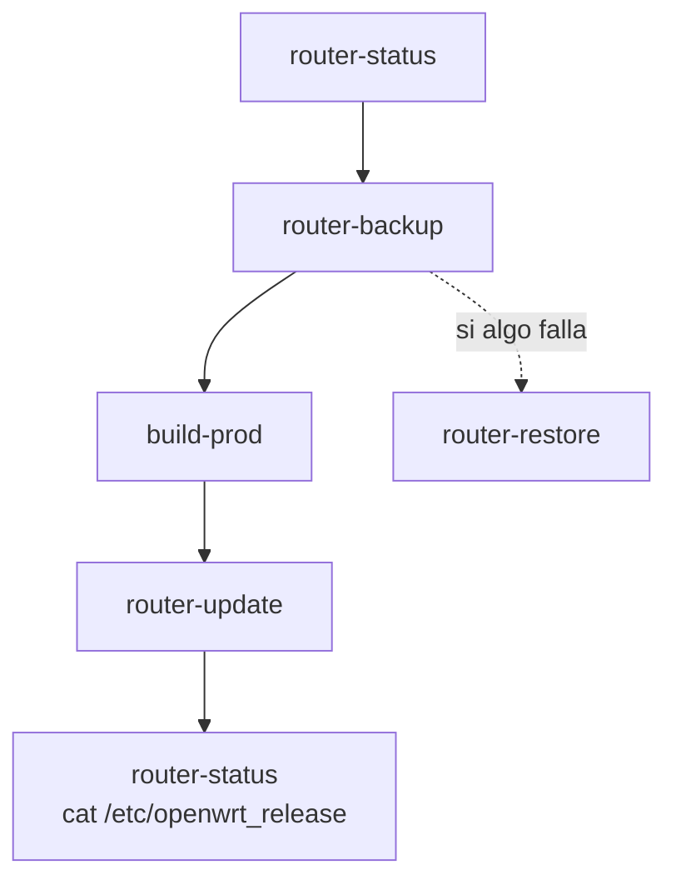

# Backup, Build y Actualización Segura

## Objetivo

Compilar una imagen nueva, respaldar configuración del router y actualizar con `sysupgrade` reduciendo riesgo operativo.



## Ver estado antes de tocar

```bash
just router-status --ip 192.168.1.1
```

## Respaldar configuración

```bash
just router-backup --ip 192.168.1.1
just router-backup-list
```

## Compilar imagen

```bash
just setup-env prod
just build-prod
```

## Actualizar manteniendo configuración

```bash
just router-update --ip 192.168.1.1
```

El corte de SSH durante `sysupgrade` es normal.

## Verificar después

```bash
just router-status --ip 192.168.1.1
ssh root@192.168.1.1 'cat /etc/openwrt_release'
```

## Restaurar backup si hace falta

```bash
just router-restore --file backups/router-192.168.1.1-YYYYMMDD-HHMMSS.tar.gz --ip 192.168.1.1
```
