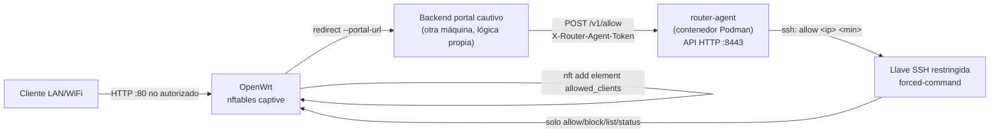

# API HTTP para Portal Cautivo Externo (router-agent)

## Objetivo

Permitir que un backend de portal cautivo **externo** (otra máquina, con su propia lógica de negocio — auth, pagos, cupos, lo que sea) autorice o revoque el acceso de una IP en el router, sin recibir nunca la llave SSH admin. La comunicación pasa por `router-agent`: un servicio HTTP pequeño (Go o Rust, a elección tras el benchmark) que guarda una llave SSH **restringida** (forced-command en Dropbear) y expone solo cuatro acciones: `allow`, `block`, `list`, `status`.



## Prerrequisitos

1. Portal cautivo instalado en modo externo:
   ```bash
   just router-captive-setup portal-url=https://portal.example.com
   ```
2. Llave SSH restringida aprovisionada:
   ```bash
   just router-agent-provision
   ```
3. Imagen del agente construida:
   ```bash
   just router-agent-build-go     # o router-agent-build-rust
   ```

## Levantar el agente

```bash
just router-agent-run-go
# escuchando en :8443
```

Variables relevantes que consume el contenedor (ver [router-agent/README.md](../../../router-agent/README.md)): `ROUTER_AGENT_API_TOKEN`, `ROUTER_AGENT_ALLOWED_CIDRS` — configúralas según dónde vive el backend del portal cautivo (su IP/subred debe estar en el allowlist).

## Flujo desde el backend externo

Cuando el backend del portal cautivo decide (por sus propias reglas de negocio) que un cliente ya pagó / se autenticó / lo que sea:

```bash
curl -X POST http://<agent-host>:8443/v1/allow \
  -H "X-Router-Agent-Token: ${TOKEN}" \
  -H "Content-Type: application/json" \
  -d '{"ip":"192.168.1.146","timeout_min":120}'
```

Cuando expira la sesión de negocio (o se quiere revocar antes):

```bash
curl -X POST http://<agent-host>:8443/v1/block \
  -H "X-Router-Agent-Token: ${TOKEN}" \
  -H "Content-Type: application/json" \
  -d '{"ip":"192.168.1.146"}'
```

Consultar clientes autorizados y salud del router:

```bash
curl -H "X-Router-Agent-Token: ${TOKEN}" http://<agent-host>:8443/v1/list
curl -H "X-Router-Agent-Token: ${TOKEN}" http://<agent-host>:8443/v1/status
```

## Verificación cruzada

Lo que hace el agente por HTTP es equivalente a lo que hace `just router-captive-allow`/`router-captive-block` por SSH admin — ambos caminos mutan el mismo set nftables (`allowed_clients`, tabla `ip captive`). Para confirmar que ambos caminos ven el mismo estado:

```bash
just router-captive-list
```

## Seguridad — qué NO puede hacer un compromiso de este componente

Ver la tabla de blast radius en [router-agent/README.md](../../../router-agent/README.md#seguridad). En resumen: si se filtra la llave restringida, el token, o el contenedor completo se compromete, el atacante solo puede autorizar/revocar IPs en `allowed_clients` — nunca obtiene shell, no puede reflashear, leer WiFi/WireGuard, ni tocar ninguna otra configuración del router. Eso requiere la llave admin, que nunca se monta en este contenedor.
