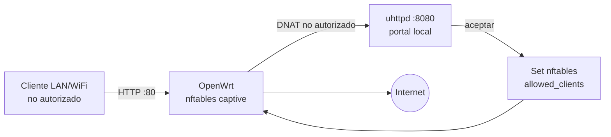

# Portal Cautivo Local

## Objetivo

Instalar un portal cautivo básico en el router usando `nftables` + `uhttpd`, sin OpenNDS.



## Instalar paquetes post-flash

```bash
just router-post-install captive_portal
```

## Instalar portal

```bash
just router-captive-setup 192.168.1.1 prod 30
```

El `30` indica timeout de autorización en minutos.

## Estado y diagnóstico

```bash
just router-captive-status 192.168.1.1
just router-captive-list 192.168.1.1
just router-status --ip 192.168.1.1
```

## Autorizar manualmente un cliente

```bash
just router-captive-allow 192.168.1.146 192.168.1.1 prod 120
```

## Revocar o limpiar

```bash
just router-captive-block 192.168.1.146
just router-captive-flush 192.168.1.1
```

## Desinstalar

```bash
just router-captive-remove 192.168.1.1
```
