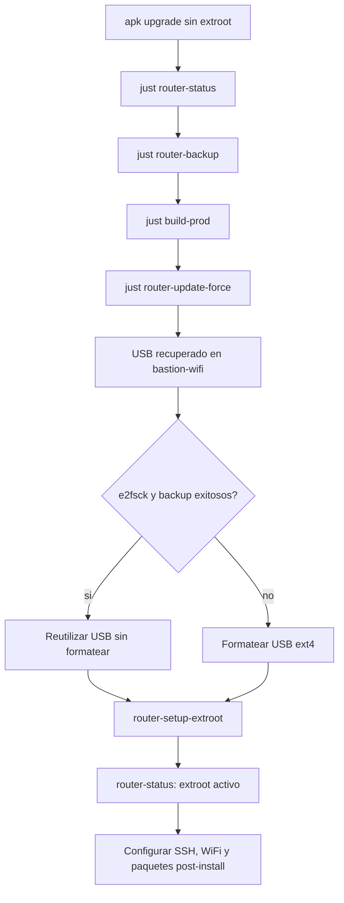

# Reinstalacion limpia y extroot despues de `apk upgrade`

Caso: se ejecuto `apk upgrade` antes de montar el USB como extroot. Los paquetes actualizados quedaron en el overlay interno del router y pueden consumir casi todo el espacio writable. El objetivo es volver a una imagen conocida, conservar el USB si es recuperable y montar extroot antes de instalar paquetes adicionales.



## Que implica

`just router-update-force` instala la imagen sysupgrade compilada y ejecuta `sysupgrade -n`. Esto borra los cambios persistentes del router en `/overlay`, incluyendo contraseña root, claves SSH, WiFi, reservas DHCP, fstab y paquetes instalados posteriormente con `apk`. Los valores que `build-prod` haya incluido en la imagen vuelven a aplicarse.

No formatea automaticamente el USB. El USB debe tratarse por separado:

- `host-recover-extroot-usb` repara ext4 y crea un backup sin formatear.
- `host-format-extroot-usb` borra la particion y la crea de nuevo como ext4.
- `router-setup-extroot` copia el overlay limpio al USB y configura `/overlay`.

## 1. Diagnosticar y respaldar

Desde la maquina con acceso SSH al router:

```bash
just router-status --ip 192.168.1.1
just router-backup --ip 192.168.1.1
just router-backup-list
```

Guarda la ruta del backup. No ejecutes `apk upgrade` nuevamente mientras `/overlay` no sea el USB.

## 2. Compilar la imagen correcta

Verifica que el entorno use OpenWrt 25.12.5, el target `ath79/generic` y el perfil `tplink_tl-wdr3600-v1`:

```bash
just setup-env prod
just build-prod
```

La imagen debe terminar en `openwrt-25.12.5-ath79-generic-tplink_tl-wdr3600-v1-squashfs-sysupgrade.bin`. No uses una imagen de otro modelo.

## 3. Reinstalar el router sin conservar el overlay

Conecta el router por Ethernet y ejecuta:

```bash
just router-update-force --ip 192.168.1.1
```

Confirma solo despues de revisar la advertencia. El router reiniciara y la conexion SSH se interrumpira durante el proceso.

Cuando vuelva a responder, vuelve a instalar la clave si la imagen no la incluye:

```bash
just router-copy-keys --ip 192.168.1.1
```

Si tambien necesitas establecer la contrasena root manualmente:

```bash
just router-setup-auth 192.168.1.1 prod
```

## 4. Recuperar el USB en `bastion-wifi`

Retira el USB del router y conectalo al bastion. No asumas que conserva el mismo nombre de dispositivo: en el router puede ser `/dev/sda1` y en el bastion `/dev/sdb1`.

```bash
ssh bastion-wifi
cd /opt/repository/github/PoC-OpenWRT-Raspi3b
git pull --ff-only
just host-recover-extroot-usb --list
```

En Debian, si falta `e2fsck`, instala la dependencia:

```bash
sudo apt update
sudo apt install -y e2fsprogs
```

Ejecuta la reparacion sobre la particion USB, por ejemplo:

```bash
just host-recover-extroot-usb --device /dev/sdb1
```

Confirma escribiendo exactamente `REPARAR /dev/sdb1`. Un resultado con `FILE SYSTEM WAS MODIFIED` significa que `e2fsck` corrigio el filesystem; la recipe continuara y creara el backup en `~/openwrt-extroot-backups/`.

## 5. Elegir reutilizar o formatear

Si el backup termino correctamente y el filesystem se puede montar, puedes reutilizar el USB sin formatear. Si el contenido tiene errores persistentes, falta la estructura de extroot o quieres empezar completamente limpio, formatealo:

```bash
just host-format-extroot-usb --device /dev/sdb1
```

La recipe exige una confirmacion textual y no acepta el disco completo, solo una particion USB como `/dev/sdb1`. El formateo elimina el contenido de esa particion.

## 6. Configurar extroot de nuevo

Conecta el USB al router. El nombre puede volver a ser `/dev/sda1`; compruebalo con `router-status` si es necesario.

```bash
just router-setup-extroot --ip 192.168.1.1 --device /dev/sda1
```

Si detecta contenido anterior, confirma la limpieza solo despues de verificar que el backup existe. Esta limpieza de archivos no es un formateo de la particion.

## 7. Validar antes de instalar paquetes

```bash
just router-status --ip 192.168.1.1
```

El resultado esperado incluye:

```text
USB       : detectado
/dev/sda1 ... /overlay
Extroot   : activo (/dev/sda1, ext4)
```

Solo despues de esa validacion instala paquetes opcionales:

```bash
just router-post-install diagnostico 192.168.1.1 prod
```

Para consultar los grupos disponibles sin instalar, usa directamente el script:

```bash
scripts/router/post-install.sh --list
```

## 8. Restaurar configuracion selectivamente

El backup del router es util para consultar o restaurar configuracion, pero no restaures ciegamente todo `/etc/config` despues de activar extroot: puedes sobrescribir `fstab` y volver a perder el montaje.

Primero valida extroot y luego repone solo las funciones necesarias, por ejemplo reservas DHCP:

```bash
just router-static-ip-add --ip 192.168.1.1 --mac a8:60:b6:0f:f7:6a --assign 192.168.1.146 --name alqrab
just router-static-ip-add --ip 192.168.1.1 --mac d8:3a:dd:4d:4b:ae --assign 192.168.1.167 --name raspi4b
just router-static-ip-add --ip 192.168.1.1 --mac 0c:4d:e9:bf:6e:91 --assign 192.168.1.139 --name bastion
```

## Resultado operativo

El orden importante para evitar repetir el problema es:

```text
compilar -> respaldar -> reinstalar -> reparar/respaldar USB -> montar extroot -> validar -> instalar paquetes
```

Mientras `router-status` no muestre `Extroot : activo`, no ejecutes `apk upgrade` ni instales grupos post-install grandes.
