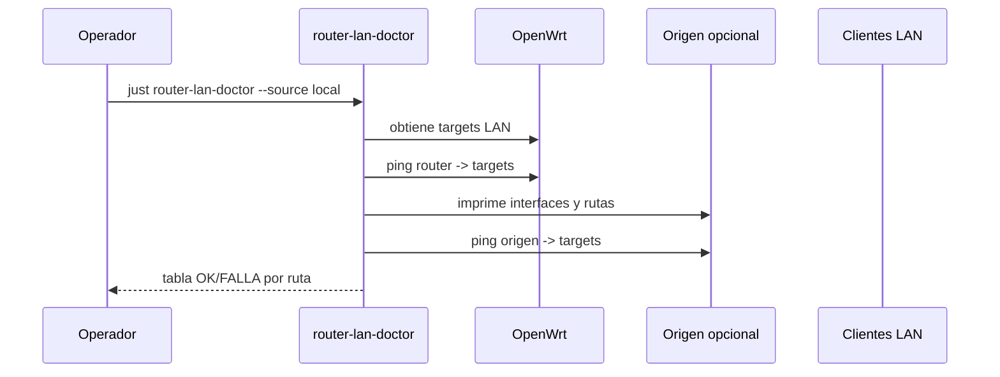

# Diagnóstico de Comunicación LAN

## Objetivo

Detectar si un problema de conectividad está en el router, en el equipo origen, en rutas, firewall o leases DHCP viejos.



## Validar desde el router

```bash
just router-lan-doctor --ip 192.168.1.1
```

## Validar desde el equipo actual

```bash
just router-lan-doctor --ip 192.168.1.1 --source local
```

## Validar desde bastion

```bash
just router-lan-doctor --ip 192.168.1.1 --source rafex@192.168.3.143
```

## Validar targets específicos

```bash
just router-lan-doctor --ip 192.168.1.1 --source local \
  --target 192.168.1.146 \
  --target 192.168.1.167 \
  --target 192.168.1.139
```

## Interpretación

| Router -> target | Origen -> target | Lectura |
|------------------|------------------|---------|
| OK | OK | Comunicación interna funciona. |
| OK | FALLA | El origen tiene problema de ruta, firewall o aislamiento. |
| FALLA | FALLA | El target no responde o no está en red. |
| FALLA | OK | Caso raro; revisar firewall del router o rutas asimétricas. |

## Nota de formato de IP

Usa siempre cuatro octetos:

```bash
ping 192.168.1.146
```

No uses formas abreviadas como `192.168.146`; Linux puede interpretarlas como `192.168.0.146`.
