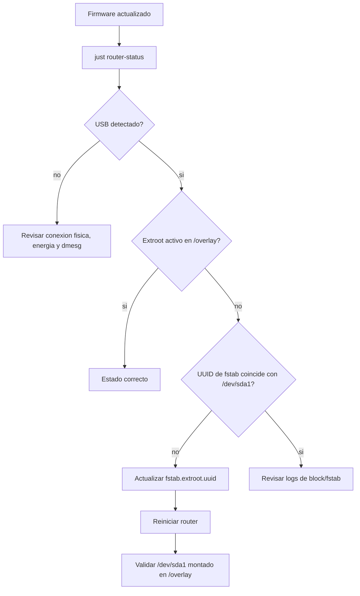

# Recuperar USB extroot despues de actualizar firmware

Caso: despues de actualizar OpenWrt, el router arranca bien pero el USB ya no aparece montado como `/overlay`. El sintoma tipico es que `router-status` muestra poco espacio en `/overlay`, el USB aparece como `/dev/sda1`, pero `Extroot` no esta activo.



## Objetivo

Restaurar el montaje del USB como extroot sin borrar el contenido existente del USB. Esto es importante si el USB ya contiene una instalacion previa de extroot con directorios como `upper`, `work` y `.fs_state`.

## 1. Actualizar herramientas del repo

Ejecuta esto desde la maquina que tenga SSH al router, por ejemplo el bastion:

```bash
ssh bastion-wifi
cd /opt/repository/github/PoC-OpenWRT-Raspi3b
git pull --ff-only
```

## 2. Diagnosticar el estado

Primero usa el status general:

```bash
just router-status --ip 192.168.1.1
```

En el bloque `ALMACENAMIENTO`, busca estas senales:

```text
USB       : detectado
/dev/sda1 ext4 ... Montado -
Extroot   : no es USB (/dev/mtdblock4, jffs2)
fstab     : extroot enabled=1 ... uuid=<uuid-viejo>
```

Ese estado significa que el USB existe y esta formateado, pero OpenWrt arranco usando la flash interna como `/overlay`.

Tambien puedes revisar directo:

```bash
ssh root@192.168.1.1 'block info; ls /dev/sd* 2>/dev/null; df -h /overlay; mount | grep -E " /overlay |/dev/sd"'
```

## 3. Verificar que el USB tenga extroot existente

Antes de ejecutar cualquier setup que pueda limpiar el USB, monta temporalmente el dispositivo y mira su contenido:

```bash
ssh root@192.168.1.1 '
set -eu
mkdir -p /mnt/usb-check
mount /dev/sda1 /mnt/usb-check 2>/dev/null || true
find /mnt/usb-check -mindepth 1 -maxdepth 2 | head -80
umount /mnt/usb-check 2>/dev/null || true
'
```

Si ves algo como esto, el USB ya tiene extroot:

```text
/mnt/usb-check/upper
/mnt/usb-check/work
/mnt/usb-check/.fs_state
```

En ese caso no uses `just router-setup-extroot` para repararlo, porque ese flujo esta pensado para preparar/copiar extroot y puede pedir limpiar el USB si detecta contenido previo.

## 4. Reparar el UUID en fstab

Obtiene el UUID real de `/dev/sda1` y actualiza `fstab.extroot`:

```bash
ssh root@192.168.1.1 '
set -eu
UUID=$(block info /dev/sda1 | sed -n "s/.*UUID=\"\([^\"]*\)\".*/\1/p")
[ -n "$UUID" ]

uci -q set fstab.@global[0].auto_mount=1 || true
uci -q set fstab.@global[0].delay_root=15 || true
uci -q set fstab.@global[0].check_fs=0 || true
uci -q delete fstab.extroot.device || true
uci set fstab.extroot=mount
uci set fstab.extroot.target=/overlay
uci set fstab.extroot.fstype=ext4
uci set fstab.extroot.options=rw,sync
uci set fstab.extroot.enabled=1
uci set fstab.extroot.enabled_fsck=0
uci set fstab.extroot.uuid="$UUID"
uci commit fstab

echo "configured_uuid=$UUID"
uci show fstab.extroot
'
```

## 5. Reiniciar

```bash
ssh root@192.168.1.1 reboot
```

Espera uno o dos minutos y verifica que SSH vuelva:

```bash
ssh root@192.168.1.1 'echo up'
```

## 6. Validar que extroot quedo activo

```bash
just router-status --ip 192.168.1.1
```

El estado esperado es:

```text
/overlay     ... / 57.6G
USB       : detectado
/dev/sda1    ext4 ... /overlay
Extroot   : activo (/dev/sda1, ext4)
fstab     : extroot enabled=1 target=/overlay uuid=<uuid-actual>
```

Validacion directa:

```bash
ssh root@192.168.1.1 'df -h / /overlay; grep -E " /overlay |/dev/sda1" /proc/mounts; block info /dev/sda1; uci show fstab.extroot'
```

## 7. Corregir fstab dentro del extroot activo

Si despues del primer reinicio `/dev/sda1` ya esta montado en `/overlay`, revisa de nuevo `uci show fstab.extroot`. Si el UUID vuelve a aparecer viejo, significa que el extroot activo tenia una copia antigua de `/etc/config/fstab`. Corrigelo una vez mas con el mismo bloque del paso 4.

Despues de eso, el siguiente reinicio conservara el UUID correcto.

## 8. Reponer configuraciones que estaban solo en la flash interna

Cuando el router arranca desde el extroot del USB, usa la configuracion guardada en el USB. Si antes del montaje habias cambiado cosas en la flash interna, pueden no aparecer.

Ejemplo: reponer reservas DHCP:

```bash
just router-static-ip-add --ip 192.168.1.1 --mac a8:60:b6:0f:f7:6a --assign 192.168.1.146 --name alqrab
just router-static-ip-add --ip 192.168.1.1 --mac d8:3a:dd:4d:4b:ae --assign 192.168.1.167 --name raspi4b
just router-static-ip-add --ip 192.168.1.1 --mac 0c:4d:e9:bf:6e:91 --assign 192.168.1.139 --name bastion
just router-static-ip-list --ip 192.168.1.1
```

## 9. Borrar y reformatear el USB desde bastion-wifi

Si el USB ya muestra errores como `Bad message`, `can't stat` o `can't remove old file`, no sigas intentando copiar encima. Retira el USB del router, conéctalo al bastion y formatealo desde ahi:

```bash
ssh bastion-wifi
cd /opt/repository/github/PoC-OpenWRT-Raspi3b
git pull --ff-only
just host-format-extroot-usb --list
just host-recover-extroot-usb --device /dev/sdX1
just host-format-extroot-usb --device /dev/sdX1
```

Primero intenta `host-recover-extroot-usb`: ejecuta `e2fsck`, monta el USB read-only y crea un backup `.tar.gz` en `~/openwrt-extroot-backups`. Si el backup sale bien y decides borrar, usa `host-format-extroot-usb`.

La recipe de formateo exige confirmacion textual antes de borrar. Reemplaza `/dev/sdX1` por la particion USB real que muestre `--list`.

Despues conecta el USB al router y prepara extroot:

```bash
just router-setup-extroot --ip 192.168.1.1 --device /dev/sda1
```

## Cuando si usar `router-setup-extroot`

Usa este comando cuando vas a preparar un USB nuevo o quieres copiar el overlay actual al USB:

```bash
just router-setup-extroot --ip 192.168.1.1 --device /dev/sda1
```

No lo uses como primera opcion para reparar un extroot existente despues de upgrade. Primero diagnostica contenido y UUID.
