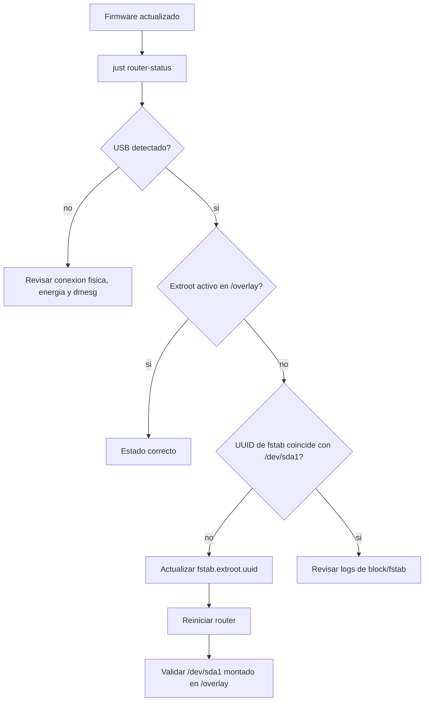

# Recuperar USB extroot despues de actualizar firmware

Caso: despues de actualizar OpenWrt, el router arranca bien pero el USB ya no aparece montado como `/overlay`. El sintoma tipico es que `router-status` muestra poco espacio en `/overlay`, el USB aparece como `/dev/sda1`, pero `Extroot` no esta activo.

Si antes de montar extroot ejecutaste `apk upgrade` y quieres reinstalar la imagen desde cero, sigue [Reinstalacion limpia y extroot despues de `apk upgrade`](clean-reinstall-and-extroot-after-apk-upgrade.md). Ese caso incluye `router-update-force`, la recuperacion del USB y el orden seguro para volver a instalar paquetes.


```mermaid
flowchart TD
    upgrade["Firmware actualizado"] --> status["just router-status"]
    status --> usb{"USB detectado?"}
    usb -- no --> physical["Revisar conexion fisica, energia y dmesg"]
    usb -- si --> extroot{"Extroot activo en /overlay?"}
    extroot -- si --> done["Estado correcto"]
    extroot -- no --> uuid{"UUID de fstab coincide con /dev/sda1?"}
    uuid -- no --> fix["Actualizar fstab.extroot.uuid"]
    uuid -- si --> logs["Revisar logs de block/fstab"]
    fix --> reboot["Reiniciar router"]
    reboot --> verify["Validar /dev/sda1 montado en /overlay"]
```

## Objetivo

Restaurar el montaje del USB como extroot sin borrar el contenido existente del USB. Esto es importante si el USB ya contiene una instalacion previa de extroot con directorios como `upper`, `work` y `.fs_state`.

## 1. Actualizar herramientas del repo

Ejecuta esto desde la maquina que tenga SSH al router, por ejemplo el bastion:

```bash
ssh bastion-wifi
cd /opt/repository/github/PoC-OpenWRT-Raspi3b
git pull --ff-only
```

## 2. Diagnosticar el estado

Primero usa el status general:

```bash
just router-status --ip 192.168.1.1
```

En el bloque `ALMACENAMIENTO`, busca estas senales:

```text
USB       : detectado
/dev/sda1 ext4 ... Montado -
Extroot   : no es USB (/dev/mtdblock4, jffs2)
fstab     : extroot enabled=1 ... uuid=<uuid-viejo>
```

Ese estado significa que el USB existe y esta formateado, pero OpenWrt arranco usando la flash interna como `/overlay`.

Tambien puedes revisar directo:

```bash
ssh root@192.168.1.1 'block info; ls /dev/sd* 2>/dev/null; df -h /overlay; mount | grep -E " /overlay |/dev/sd"'
```

## 3. Capturar estado y desmontar desde OpenWrt

Arranca el router sin USB. Cuando SSH esté disponible, conecta la USB y ejecuta:

```bash
just router-extroot-recover prepare --ip 192.168.1.1
```

El comando guarda `logread`, `dmesg`, `block info`, fstab y montajes en `~/openwrt-extroot-backups/`. Informa el UUID y desmonta la USB si se montó fuera de `/overlay`. Si indica que la unidad es `/overlay` activo o que no pudo desmontarla, no la retires.

## 4. Reparar ext4 en esta máquina Linux

Retira la USB del router y conéctala físicamente al host. Usa el UUID reportado; no dependas del nombre variable `/dev/sdX1`:

```bash
USB_UUID="<UUID reportado por prepare>"
just host-recover-extroot-usb --uuid "$USB_UUID" --repair
```

El comando guarda un respaldo completo o parcial de los archivos legibles y luego ejecuta `e2fsck -f -p` tras pedir confirmación. Si la verificación posterior deja errores sin resolver, detente: no intentes activar extroot todavía. No uses `router-setup-extroot` para recuperar datos existentes porque ese flujo copia el overlay actual y puede limpiar la USB.

## 5. Actualizar UUID y validar extroot

Solo si la verificación host terminó sin errores, reconecta la USB al router y actualiza fstab sin copiar ni limpiar archivos:

```bash
just router-extroot-recover finish --ip 192.168.1.1 --uuid "$USB_UUID"
```

El comando no reinicia. Revisa el resultado y después reinicia manualmente. Al volver, valida:

```bash
just router-status --ip 192.168.1.1
```

El estado esperado es `Extroot: activo` y `/dev/sdX1` montado en `/overlay`.

## 8. Reponer configuraciones que estaban solo en la flash interna

Cuando el router arranca desde el extroot del USB, usa la configuracion guardada en el USB. Si antes del montaje habias cambiado cosas en la flash interna, pueden no aparecer.

Ejemplo: reponer reservas DHCP:

```bash
just router-static-ip-add --ip 192.168.1.1 --mac a8:60:b6:0f:f7:6a --assign 192.168.1.146 --name alqrab
just router-static-ip-add --ip 192.168.1.1 --mac d8:3a:dd:4d:4b:ae --assign 192.168.1.167 --name raspi4b
just router-static-ip-add --ip 192.168.1.1 --mac 0c:4d:e9:bf:6e:91 --assign 192.168.1.139 --name bastion
just router-static-ip-list --ip 192.168.1.1
```

## 9. Borrar y reformatear el USB desde bastion-wifi

Si el USB ya muestra errores como `Bad message`, `can't stat` o `can't remove old file`, no sigas intentando copiar encima. Retira el USB del router, conéctalo al bastion y formatealo desde ahi:

```bash
ssh bastion-wifi
cd /opt/repository/github/PoC-OpenWRT-Raspi3b
git pull --ff-only
just host-format-extroot-usb --list
just host-recover-extroot-usb --device /dev/sdX1
just host-format-extroot-usb --device /dev/sdX1
```

Primero ejecuta `host-recover-extroot-usb` en modo diagnóstico: desmonta la partición si hace falta, comprueba ext4 con `e2fsck -fn`, monta `ro,noload`, guarda un backup completo y extrae los logs encontrados. No modifica ext4. Si el diagnóstico reporta errores y decides repararlos, ejecuta `just host-recover-extroot-usb --device /dev/sdX1 --repair`; el script requiere confirmación textual después del respaldo. Si el backup sale bien y decides borrar, usa `host-format-extroot-usb`.

La recipe de formateo exige confirmacion textual antes de borrar. Reemplaza `/dev/sdX1` por la particion USB real que muestre `--list`.

Despues conecta el USB al router y prepara extroot:

```bash
just router-setup-extroot --ip 192.168.1.1 --device /dev/sda1
```

## Cuando si usar `router-setup-extroot`

Usa este comando cuando vas a preparar un USB nuevo o quieres copiar el overlay actual al USB:

```bash
just router-setup-extroot --ip 192.168.1.1 --device /dev/sda1
```

No lo uses como primera opcion para reparar un extroot existente despues de upgrade. Primero diagnostica contenido y UUID.
