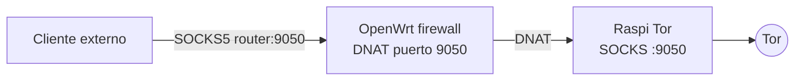

# Port Forwarding del Proxy SOCKS de Tor

## Objetivo

Exponer el SOCKS5 de Tor que corre en una Raspberry Pi para que otros equipos puedan usarlo explícitamente con `curl`, navegador o variables de entorno.



## Activar

```bash
just router-socks-enable --raspi-ip 192.168.1.167 --port 9050 --ip 192.168.1.1
```

## Ver estado

```bash
just router-socks-status --ip 192.168.1.1
```

## Probar desde un cliente

```bash
curl --socks5-hostname 192.168.1.1:9050 https://check.torproject.org/
```

## Desactivar o desinstalar

```bash
just router-socks-disable --ip 192.168.1.1
just router-socks-uninstall --ip 192.168.1.1
```

`disable` quita la regla DNAT. `uninstall` también elimina la reserva DHCP `raspi-tor` si fue creada por el flujo.
