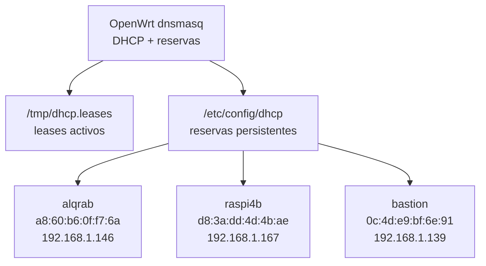

# Reservas DHCP e Inventario de Clientes

## Objetivo

Asignar IPs estables a dispositivos conocidos y validar qué IP, MAC y nombre tiene cada equipo.



## Crear reservas

```bash
just router-static-ip-add --mac a8:60:b6:0f:f7:6a --assign 192.168.1.146 --name alqrab --ip 192.168.1.1
just router-static-ip-add --mac d8:3a:dd:4d:4b:ae --assign 192.168.1.167 --name raspi4b --ip 192.168.1.1
just router-static-ip-add --mac 0c:4d:e9:bf:6e:91 --assign 192.168.1.139 --name bastion --ip 192.168.1.1
```

## Verificar

```bash
just router-static-ip-list --ip 192.168.1.1
just router-status --ip 192.168.1.1
```

## Renovar DHCP en clientes

Si una MAC aparece con IP vieja y nueva, el cliente todavía conserva un lease anterior. Renueva DHCP en el equipo afectado.

En Debian/Linux:

```bash
sudo dhclient -r enp1s0f0
sudo dhclient enp1s0f0
```

O reconecta físicamente la interfaz/cable.

## Validar conectividad

```bash
just router-lan-doctor --ip 192.168.1.1 \
  --target 192.168.1.146 \
  --target 192.168.1.167 \
  --target 192.168.1.139
```
