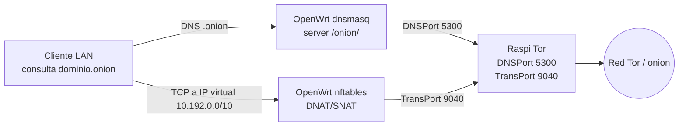

# Proxy Tor Transparente para `.onion`

## Objetivo

Permitir que clientes LAN resuelvan y naveguen dominios `.onion` sin configurar proxy en cada dispositivo. OpenWrt redirige DNS y tráfico TCP hacia Tor en una Raspberry Pi.



## Precondición en la Raspi

Tor debe exponer:

```text
VirtualAddrNetworkIPv4 10.192.0.0/10
AutomapHostsOnResolve 1
TransPort 0.0.0.0:9040
DNSPort 0.0.0.0:5300
```

## Activar

```bash
just router-onion-enable --raspi-ip 192.168.1.167 --dns-port 5300 --trans-port 9040 --ip 192.168.1.1
```

## Diagnóstico

```bash
just router-onion-status --ip 192.168.1.1
just router-onion-doctor --ip 192.168.1.1 --dns-port 5300 --trans-port 9040
```

## Desactivar o desinstalar

```bash
just router-onion-disable --ip 192.168.1.1
just router-onion-uninstall --ip 192.168.1.1
```

`disable` quita DNAT pero conserva DNS `.onion`. `uninstall` limpia todo.
