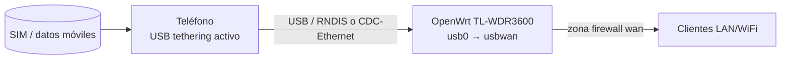

# Uplink via tethering USB (datos móviles de un teléfono)

## Objetivo

Usar los datos móviles (SIM) de un teléfono conectado por USB al router como fuente de internet, activando "Compartir internet"/tethering USB en el teléfono. Validado con un teléfono FirefoxOS: el kernel lo detecta como dispositivo `rndis_host`, obtiene IP por DHCP del propio teléfono (típicamente `192.168.0.0/24`, gateway `192.168.0.1`), y el router lo usa como uplink adicional junto a los que ya tenga (WAN físico, WiFi cliente).



## Precondiciones

```bash
just router-status --ip 192.168.1.1
```

Verifica que el firmware tiene los drivers cargados (`config/openwrt-packages.toml`, categoría `usb` → `kmod-usb-net-rndis`/`kmod-usb-net-cdc-ether`). Si el router fue flasheado antes de que este paquete se agregara al build, necesitas recompilar y reflashear.

## Paso 1: activar tethering en el teléfono

En el teléfono: **Ajustes → Uso de datos → Compartir internet / USB Tethering** → activar. Con el teléfono en modo solo carga/almacenamiento el router **no** verá ningún dispositivo de red.

## Paso 2: conectar el teléfono por USB y verificar detección

```bash
just router-usb-tether-status --ip 192.168.1.1
```

Debe reportar el dispositivo detectado (ej. `usb0`, driver `rndis_host`). Si dice que no hay ningún dispositivo, revisa que el tethering esté realmente activo en el teléfono (no solo el cable conectado).

## Paso 3: activar el uplink

```bash
just router-usb-tether-enable --ip 192.168.1.1
```

Crea la interfaz `usbwan` (DHCP) y la añade a la zona firewall `wan`. Espera unos segundos a que el DHCP del teléfono asigne IP.

## Paso 4: validar

```bash
just router-usb-tether-status --ip 192.168.1.1
```

Debe mostrar `activa: true`, el dispositivo (`usb0`), la IP asignada y el gateway del teléfono. Para confirmar salida real a internet por esa ruta específica (sin depender de cuál uplink esté priorizado):

```bash
ssh root@192.168.1.1 "ping -c2 -I <IP-asignada-a-usb0> 8.8.8.8"
```

## Prioridad frente a otros uplinks

Si el router ya tiene WAN físico o WiFi cliente (`wwan`) activos, el kernel elige la ruta por defecto por métrica — `usbwan` convive con ellos pero no necesariamente gana como ruta principal. Para forzar prioridad, usa el mecanismo existente en `setup-routing.sh`:

```bash
just router-routing-status --ip 192.168.1.1
```

(la integración explícita de `usbwan` como tercera opción de prioridad, junto a `wan`/`wifi`, queda pendiente si se necesita más adelante).

## Desactivar

```bash
just router-usb-tether-disable --ip 192.168.1.1
```

Retira `usbwan` de la configuración de red y de la zona firewall `wan`. No desconecta el teléfono ni desactiva su tethering — eso se hace desde el propio teléfono.

## Troubleshooting

Si `status` no detecta ningún dispositivo pero el teléfono está en modo tethering:

```bash
ssh root@192.168.1.1 "dmesg | tail -30 | grep -iE 'usb|rndis|cdc'"
```

Busca líneas `register 'rndis_host'` o `register 'cdc_ether'`. Si no aparecen, revisa el cable/puerto USB o que el firmware tenga los kmods correspondientes instalados.

Si `usbwan` está activo pero sin gateway (`GW` vacío en el status): algunos modos de tethering no anuncian gateway por DHCP — revisa la configuración de tethering del teléfono.
