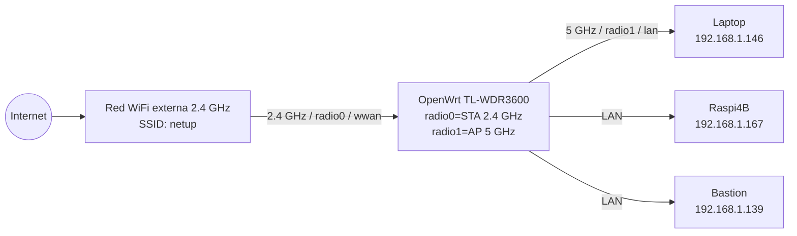

# Uplink WiFi 2.4 GHz + AP 5 GHz

## Objetivo

Conectar el router OpenWrt como cliente WiFi a una red externa de 2.4 GHz, por ejemplo `netup`, y después ofrecer una red AP propia en 5 GHz para los clientes internos.

Este caso usa:

- `radio0` / 2.4 GHz como cliente WiFi (`sta`) hacia internet.
- `radio1` / 5 GHz como Access Point (`ap`) en la red `lan`.
- `wwan` como interfaz de salida por WiFi.
- `lan` como red local para clientes del router.



## Precondiciones

Verifica que el router responde:

```bash
just router-status --ip 192.168.1.1
```

Verifica radios:

```bash
just router-wifi-status 192.168.1.1
```

## Paso 1: conectar el router como cliente 2.4 GHz

Usa `radio0` o alias `2g`:

```bash
just router-wifi-client --ip 192.168.1.1 --radio 2g --ssid netup
```

El comando puede pedir la contraseña de la red externa. Si quieres pasarla directamente:

```bash
just router-wifi-client --ip 192.168.1.1 --radio 2g --ssid netup --password 'password-de-netup'
```

Verifica:

```bash
just router-wifi-status 192.168.1.1
just router-status --ip 192.168.1.1
```

Debes ver una interfaz `sta` activa en `radio0`, conectada a `netup`, con red `wwan`.

## Paso 2: activar AP en 5 GHz

Usa `radio1` o alias `5g`:

```bash
just router-wifi-ap --ip 192.168.1.1 --radio 5g --ssid OpenWrt-5G --channel 36
```

El comando pedirá contraseña WPA2 si no pasas `--password`.

Con contraseña explícita:

```bash
just router-wifi-ap --ip 192.168.1.1 --radio 5g --ssid OpenWrt-5G --password 'clave-segura-123' --channel 36
```

Para AP abierto, solo en pruebas:

```bash
just router-wifi-ap --ip 192.168.1.1 --radio 5g --ssid OpenWrt-5G --open --channel 36
```

## Paso 3: validar clientes e internet

```bash
just router-wifi-status 192.168.1.1
just router-status --ip 192.168.1.1
just router-clients --ip 192.168.1.1
```

Para validar comunicación interna desde un equipo como bastion:

```bash
just router-lan-doctor --ip 192.168.1.1 --source local
```

## Troubleshooting

Si `radio1` aparece deshabilitado:

```bash
just router-wifi-enable radio1 192.168.1.1
```

Si el router no tiene internet:

```bash
just router-routing-status 192.168.1.1
just router-routing-priority wifi --ip 192.168.1.1
```

Si los clientes no reciben IP:

```bash
just router-status --ip 192.168.1.1
just router-clients --ip 192.168.1.1
```
